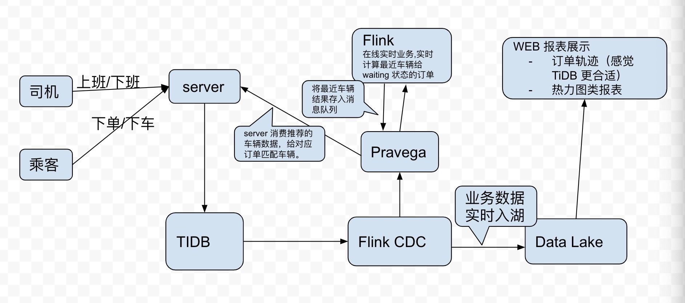

# Demo 说明

## Demo 涉及表格说明

### cars,记录当前车辆地址，状态信息
- id: 唯一标识,BIGINT
- location-x: double
- location-y:double
- status: idle/running/off,varchar
- createtime: DATETIME
- updatetime: DATETIME

### orders，记录乘客订单信息
- id:唯一标识 BIGINT
- car_id: 当前用车 BIGINT
- from_x:double
- from_y:double
- to_x:double
- to_y:double
- status:running/finished/waiting
- createtime: DATETIME
- updatetime: DATETIME


### nearcars, 记录 flink 计算出来的最近 N 辆车信息
- id:唯一标识
- order_id: 订单ID
- cars:string, json, 表示推荐车辆 ID ，如 [1,2,3,4]
- consumed: int, 是否被消费过，默认 0 未消费过。1 表示该数据已经被处理过。
- create_time: Datetime
  
## 脚本监听事件说明
Demo 主要通过模拟实现以下几个事件，来模拟本项目在网约车实时调度。

### 司机
#### 司机上班
- 将司机信息注册/更新到 cars 表格中(insert/update）, 车辆状态设置为 on，位置信息更新

 ``` TIDB
  insert into cars set id=?,location, for duplicate.. set status=on,location..
  ``` 

TODO: 该脚本可以模拟初始化大量司机。

#### 司机下班
1. 检查是否正在订单中，若否，拒绝
2. 司机下班：将当前车辆状态设置为 off

``` TIDB
begin()
 select * from cars where id=xx for update
 // check status
 update cars set status=off where id=xxx
commit
```

### 乘客
#### 乘客下单
1. 根据当前乘客的位置信息，使用 flink 计算出适合他的车辆信息
```
TODO: Flink SQL
```

2. 将下单数据更新到 TiDB
    - 更新当前车辆状态为 running
    - 创建订单信息 order

``` TIDB 
 begin()
 // check and update car's status
 update cars set status=running where status=on and id=xx
 // init order
 insert into order set ...

```

#### 乘客下车
更新 TiDB
- 更新订单状态
- 更新司机状态及车辆位置

``` TIDB
begin()
// update order
update orders set status=closed
// update car's status & location
update cars..
commit()
```


## 数据流向架构


1. 所有数据更新都写入到 TiDB,这里 TIDB 提供 OLTP.
2. 用户获取最近空闲车辆信息，从 Flink 实时计算获取。
3. TiDB 数据通过 Flink CDC 到 Pravega 和 DataLake
   1. 实时分析通过 Pravega 提供给 Flink 进行计算
   2. 离线分析通过 Data Lake.
4. WEB 前端数据从 DataLake 获取（离线分析）


# 目前 Demo 走 HTTP 协议
## Web 启动条件：
数据库条件 ：
- 目前默认连接方式  "root:@tcp(127.0.0.1:4000)/test?charset=utf8"，可根据需要修改 main 函数对应内容。
- 创建表：./data/create_table.sql
- 启动方式：
```
cd ../web
go build
./web 
```
## 接口说明
### 司机上班
司机状态变为 running.
上班条件为：当前司机状态处于 offline.
```
// PUT /car/{id}?x=${x}&y=${y}
// create a car or online a car
// Example: curl -X PUT "http://localhost:8000/car/1?x=12&y=13"
```

### 司机下班
司机状态变为 offline. 
下班条件为：当前司机状态为 idle. 

```
// DELETE /car/{id}
// offline a car
// Example: curl -X DELETE "http://localhost:8000/car/1"
```

### 乘客下单
下单后，当前订单状态为 waiting, 等待接单

```
// PUT /order?fromx=?&fromy=?&tox=?toy=?
// a new order
// Example: curl -X PUT "http://localhost:8000/order?fromx=1&fromy=2&tox=12&toy=13"
```


### 结束订单
结束订单后，订单状态变为 finished, 司机状态变为 idle.
结束条件为：当前订单状态为 running.
```
// DELETE /order/{orderID}
// Finish an order
// Example: curl -X DELETE "http://localhost:8000/order/1"
```


